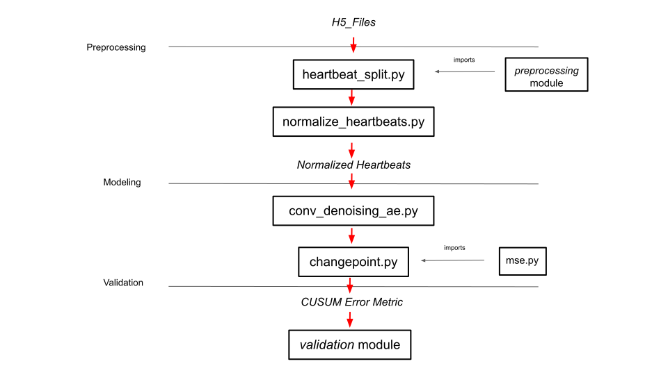

# Detection of Cardiac Electrical Instability Prior to Cardiac Arrest
Rice D2K Lab Fall 2020 project

By: Aneel Damaraju, Chiraag Kaushik, Andrew Pham, Kunal Rai, Tucker Reinhardt, Frank Yang

Mentors: Sebastian Acosta, PhD; Mubbasheer Ahmed, MD; Parag Jain, MD

# The Project 

This main goal of this project is to develop an algorithm for early detection of electrical instability of the heart, specifically in pediatric patients with hypoplastic left heart syndrome. To learn more about this project check out [this link!](https://github.com/RiceD2KLab/TCH_CardiacSignals_F20/blob/master/ReportPDF.pdf)

# To use this Repository

**Ensure that the working directory of any python files are set to the project root**\
This will ensure that package imports work inside the project\
*Pycharm*: Edit the run configuration and set the working directory to the project root\
*Terminal*: From the project root, run `export PYTHONPATH=$PYTHONPATH:'pwd'` to set the working directory, then run the desired script from the project root (i.e. `python3 src/<package_name>/.../<scriptname>.py`

## Installation

`git clone https://github.com/RiceD2KLab/TCH_CardiacSignals_F20.git` \
`pip3 install -r requirements.txt` \
NOTE: tensorflow is not yet available for Python 3.9; please use Python 3.8.5

Download the H5 files folder from the TCH box into the project root. **Rename  to `Data_H5_Files`**

## Running code 
We provide the notebook `run.ipynb` that runs a sample patient (id = 16) through our pipeline. Specifically, it runs the
patient through our preprocessing, modeling, and validation sections of the pipeline.\
The notebook defaults to loading a pretrained model to avoid the expensive autoencoder training step. **To get this pretrained model, 
download the pretrained model weights from the TCH Box into the Working_Data directory (detailed instructions inside the notebook)**

For reproducibility, we add notes in the `README` for each module on how to reproduce our figures. Head to the [``src``directory](https://github.com/RiceD2KLab/TCH_CardiacSignals_F20/tree/master/src), for information on preprocessing, modeling and validation.
The following diagram is an overview of the files associated with our data science pipeline
 

# In this directory
* `Data_H5_Files/` - contains the raw ECG signals in the form of H5 files -> contains sample for patient 16
* `images/` - contains plots used for the final report and presentation
*  `src/` - source code for the project
* `Working_Data/` - directory for intermediate data such as normalized heartbeats, reconstructions, etc.
* ``ReportPDF.pdf``- Formal final report for this project
* ``requirements.txt`` - Packages required to run this repository
* `run.ipynb` - notebook for running a single patient through the pipeline, including preprocessing and modeling

# Downloading Data Files
## Original Data
The data we used to develop the pipeline is in the TCH Box, located in the folder called `Data H5 Files`. 
If you want to run the original data through the pipeline, then download the H5 files from the above folder into the `Data_H5_Files` folder in the repo. (Note the underscores)

## Adding New Data
If you want to run new data through the pipeline, then for each patient: 
1) Put 6 hours of 4-lead ECG data into an H5 file
2) Name the H5 file `Reference_idx_{unique_id}_Time_block_1.h5`, where `{unique_id}` is some unique number that is not already used within the `src/utils/file_indexer.py` indices.
3) Put this file in the `Data_H5_Files` array 
4) Add the unique index of the file into the `new_patient_id` array

*Note: If there are any IDs in the `new_patient_id` array, then the pipeline defaults to reading from this array. 
If the `new_patient_id` array is empty, then the pipeline defaults to using the original data referenced in the previous subsection. 